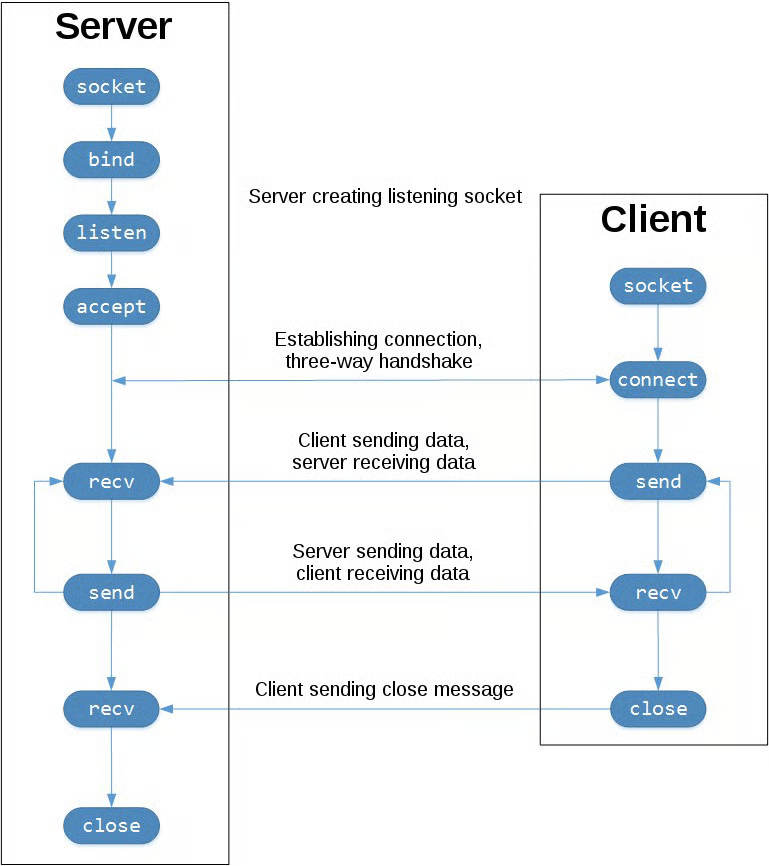

# Socket Programming
### Defination 
- A Socket is one Endpoint between a two way communication from a process on one computer to a process to another computer. These Sockets are **Inter Process Communication**, 
  - **EndPoint** - An enpoint is an combination of Ip address and an Port number , usally sits at the end of the process (visually). Every TCP connection have 2 unique endpoints     
### Compared_To_Networks
- sockets acts like bridges for Applications(L7) by using protocls like TCP/UDP(L4).

**Q. If Port number exist why create socket?**  
**A) Sockets are the actulal software that is used for the data transfer of the Proccess while port number is where the deivice listens to for incomming of communications** 

### Process of communications btw server and client
- 

## Echo Client and Server 
- Creating an loopback address 
  - **Loopback address** - A logicall local address that is used to send data to itself 
``` python 
import socket

HOST = "127.0.0.1"  # Standard loopback interface address (localhost)
PORT = 65432  # Port to listen on (non-privileged ports are > 1023)

with socket.socket(socket.AF_INET, socket.SOCK_STREAM) as s:
    s.bind((HOST, PORT))
    s.listen()
    conn, addr = s.accept()
    with conn:
        print(f"Connected by {addr}")
        while True:
            data = conn.recv(1024)
            if not data:
                break
            conn.sendall(data)
```
  -  ` with socket.socket(socket.AF_INET, socket.SOCK_STREAM) as s:  
 `  
  here ***with*** is used for control flow which is using  Context Manager Protocol 
  ***Context  Manger Protocol*** -  basically defines the entry and exit points and runtime context
  **AF_INET** is the socket type  of  IPv4 network family and **SOCK_STREAM** is the esocket type of TCP.

- `s.bind((HOST, PORT))`Bind binds the host and the port number to the created socket, here Bind actually  establish what the socket network interface and its port number be , it is giving meaning to Socket . Here the HOST part can be left blank but we choose an IPV4 loopback address
and Port is where the server will listen to 

- `s.listen()
    conn, addr = s.accept()` Here .listen() makes the server an listening socket and allow client to make an 3 way handshake tcp connection to the socket, once the TCP connection is established  with the socket
    it  waits in the ***unaccepted connections list*** the completed TCP connections will wait in the queue (the list ) . To accept them  we use accept() -  it returns its  own socket after the successfull TCP connection witch will contian the actuall data.   
    ***s*** - Socket Only used for connecting   
    ***conn*** - Socket that has an established TCP connctions with the Data.   
    This is the Socket used for communication 

- `data = conn.recv(1024)`  the .recv sens an empty list signaling the server that the connection has closed ***Q) Is this gotta do somethign with the port no 1024?*** A) No The no is no of bytes per call.
SO once we recive an empty object that is the EOL

- `connn.sendall(data)` what ever meesage is sent by clients it is echoed back by .sendall()

#### Communication Breakdown 
- We use Loobpack interface here to communicate client and server within an single host 


- Applicatiosn uses loopback interface  to securly communicate  with other applications inside the host to isolate from external network


## Multiple Connections
- 